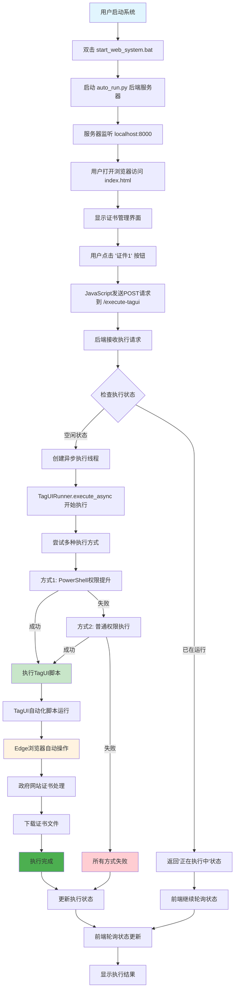
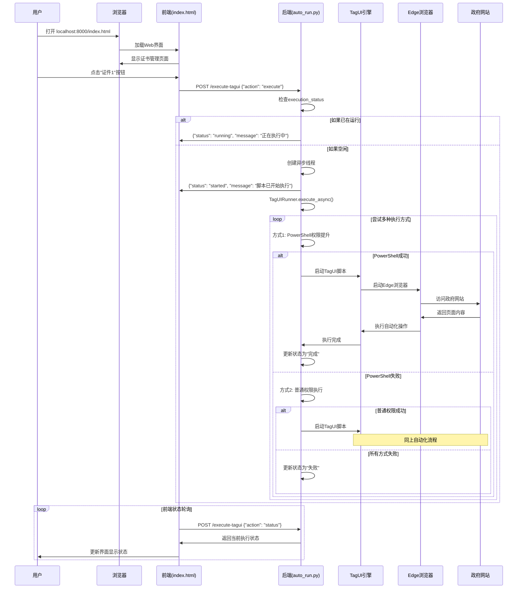
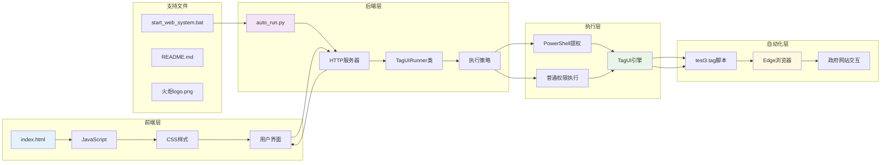
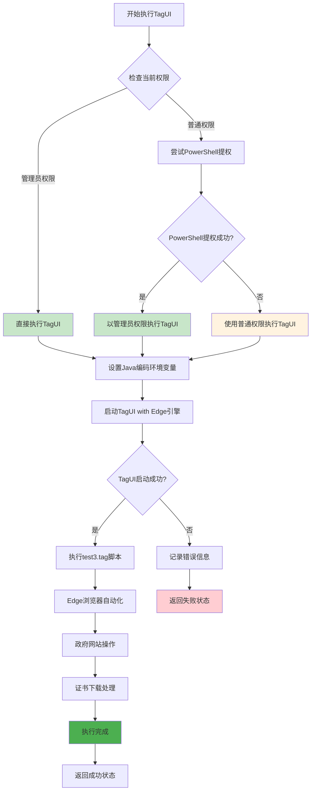
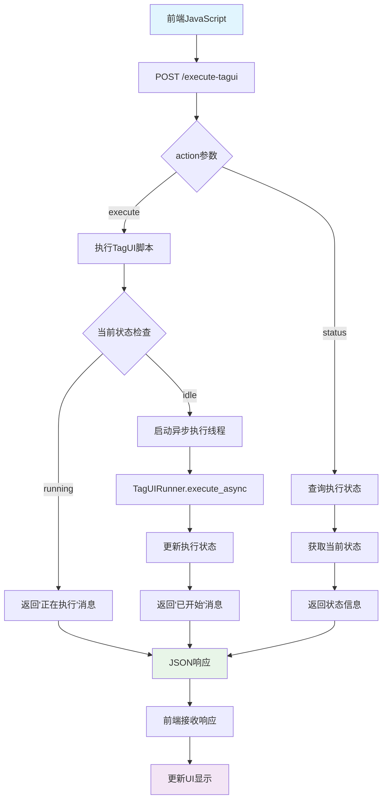
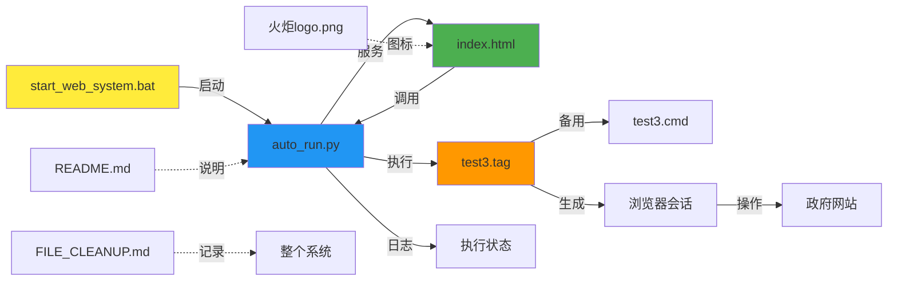

# TagUI Web管理系统流程图

## 🎯 系统整体架构流程图

```mermaid
graph TD
    A[用户启动系统] --> B[双击 start_web_system.bat]
    B --> C[启动 auto_run.py 后端服务器]
    C --> D[服务器监听 localhost:8000]
    D --> E[用户打开浏览器访问 index.html]
    
    E --> F[显示证书管理界面]
    F --> G[用户点击 '证件1' 按钮]
    G --> H[JavaScript发送POST请求到 /execute-tagui]
    
    H --> I[后端接收执行请求]
    I --> J{检查执行状态}
    J -->|已在运行| K[返回'正在执行中'状态]
    J -->|空闲状态| L[创建异步执行线程]
    
    L --> M[TagUIRunner.execute_async 开始执行]
    M --> N[尝试多种执行方式]
    
    N --> O[方式1: PowerShell权限提升]
    O -->|成功| S[执行TagUI脚本]
    O -->|失败| P[方式2: 普通权限执行]
    P -->|成功| S
    P -->|失败| Q[所有方式失败]
    
    S --> T[TagUI自动化脚本运行]
    T --> U[Edge浏览器自动操作]
    U --> V[政府网站证书处理]
    V --> W[下载证书文件]
    W --> X[执行完成]
    
    X --> Y[更新执行状态]
    Q --> Y
    Y --> Z[前端轮询状态更新]
    Z --> AA[显示执行结果]
    
    K --> BB[前端继续轮询状态]
    BB --> Z
    
    style A fill:#e1f5fe
    style S fill:#c8e6c9
    style X fill:#4caf50
    style Q fill:#ffcdd2
    style U fill:#fff3e0
```

## 🔄 详细执行流程图

```mermaid
sequenceDiagram
    participant User as 用户
    participant Browser as 浏览器
    participant Frontend as 前端(index.html)
    participant Backend as 后端(auto_run.py)
    participant TagUI as TagUI引擎
    participant Edge as Edge浏览器
    participant Website as 政府网站
    
    User->>Browser: 打开 localhost:8000/index.html
    Browser->>Frontend: 加载Web界面
    Frontend->>Browser: 显示证书管理页面
    
    User->>Frontend: 点击"证件1"按钮
    Frontend->>Backend: POST /execute-tagui {"action": "execute"}
    
    Backend->>Backend: 检查execution_status
    alt 如果已在运行
        Backend->>Frontend: {"status": "running", "message": "正在执行中"}
    else 如果空闲
        Backend->>Backend: 创建异步线程
        Backend->>Frontend: {"status": "started", "message": "脚本已开始执行"}
        
        Backend->>Backend: TagUIRunner.execute_async()
        
        loop 尝试多种执行方式
            Backend->>Backend: 方式1: PowerShell权限提升
            alt PowerShell成功
                Backend->>TagUI: 启动TagUI脚本
                TagUI->>Edge: 启动Edge浏览器
                Edge->>Website: 访问政府网站
                Website->>Edge: 返回页面内容
                Edge->>TagUI: 执行自动化操作
                TagUI->>Backend: 执行完成
                Backend->>Backend: 更新状态为"完成"
            else PowerShell失败
                Backend->>Backend: 方式2: 普通权限执行
                alt 普通权限成功
                    Backend->>TagUI: 启动TagUI脚本
                    Note over TagUI,Website: 同上自动化流程
                else 所有方式失败
                    Backend->>Backend: 更新状态为"失败"
                end
            end
        end
    end
    
    loop 前端状态轮询
        Frontend->>Backend: POST /execute-tagui {"action": "status"}
        Backend->>Frontend: 返回当前执行状态
        Frontend->>User: 更新界面显示状态
    end
```

## 🏗️ 系统组件架构图

```mermaid
graph LR
    subgraph "前端层"
        A[index.html] --> B[JavaScript]
        B --> C[CSS样式]
        C --> D[用户界面]
    end
    
    subgraph "后端层"
        E[auto_run.py] --> F[HTTP服务器]
        F --> G[TagUIRunner类]
        G --> H[执行策略]
    end
    
    subgraph "执行层"
        H --> I[PowerShell提权]
        H --> J[普通权限执行]
        I --> K[TagUI引擎]
        J --> K
    end
    
    subgraph "自动化层"
        K --> L[test3.tag脚本]
        L --> M[Edge浏览器]
        M --> N[政府网站交互]
    end
    
    subgraph "支持文件"
        O[start_web_system.bat]
        P[README.md]
        Q[火炬logo.png]
    end
    
    D --> F
    F --> D
    K --> L
    O --> E
    
    style A fill:#e3f2fd
    style E fill:#f3e5f5
    style K fill:#e8f5e8
    style M fill:#fff8e1
```

## ⚙️ 执行策略决策树

```mermaid
graph TD
    A[开始执行TagUI] --> B{检查当前权限}
    B -->|管理员权限| C[直接执行TagUI]
    B -->|普通权限| D[尝试PowerShell提权]
    
    D --> E{PowerShell提权成功?}
    E -->|是| F[以管理员权限执行TagUI]
    E -->|否| G[使用普通权限执行TagUI]
    
    C --> H[设置Java编码环境变量]
    F --> H
    G --> H
    
    H --> I[启动TagUI with Edge引擎]
    I --> J{TagUI启动成功?}
    J -->|是| K[执行test3.tag脚本]
    J -->|否| L[记录错误信息]
    
    K --> M[Edge浏览器自动化]
    M --> N[政府网站操作]
    N --> O[证书下载处理]
    O --> P[执行完成]
    
    L --> Q[返回失败状态]
    P --> R[返回成功状态]
    
    style C fill:#c8e6c9
    style F fill:#c8e6c9
    style G fill:#fff3e0
    style P fill:#4caf50
    style Q fill:#ffcdd2
```

## 📡 API通信流程

```mermaid
graph TD
    A[前端JavaScript] --> B[POST /execute-tagui]
    B --> C{action参数}
    
    C -->|execute| D[执行TagUI脚本]
    C -->|status| E[查询执行状态]
    
    D --> F{当前状态检查}
    F -->|running| G[返回'正在执行'消息]
    F -->|idle| H[启动异步执行线程]
    
    H --> I[TagUIRunner.execute_async]
    I --> J[更新执行状态]
    J --> K[返回'已开始'消息]
    
    E --> L[获取当前状态]
    L --> M[返回状态信息]
    
    G --> N[JSON响应]
    K --> N
    M --> N
    N --> O[前端接收响应]
    O --> P[更新UI显示]
    
    style A fill:#e1f5fe
    style N fill:#e8f5e8
    style P fill:#f3e5f5
```

## 📊 文件关系图

```mermaid
graph LR
    A[start_web_system.bat] -->|启动| B[auto_run.py]
    B -->|服务| C[index.html]
    C -->|调用| B
    B -->|执行| D[test3.tag]
    D -->|备用| E[test3.cmd]
    
    F[README.md] -.->|说明| B
    G[火炬logo.png] -.->|图标| C
    H[FILE_CLEANUP.md] -.->|记录| ALL[整个系统]
    
    B -->|日志| I[执行状态]
    D -->|生成| J[浏览器会话]
    J -->|操作| K[政府网站]
    
    style A fill:#ffeb3b
    style B fill:#2196f3
    style C fill:#4caf50
    style D fill:#ff9800
```
